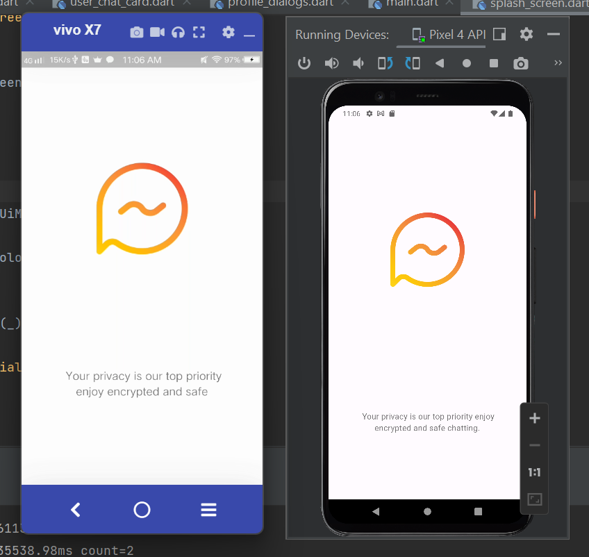
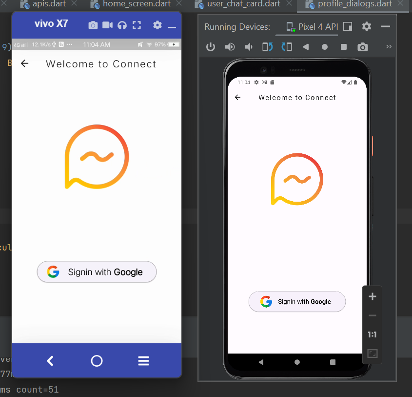
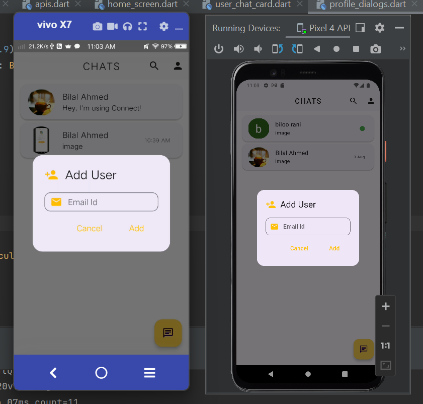
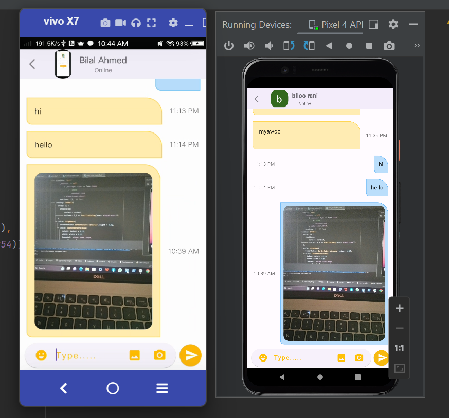
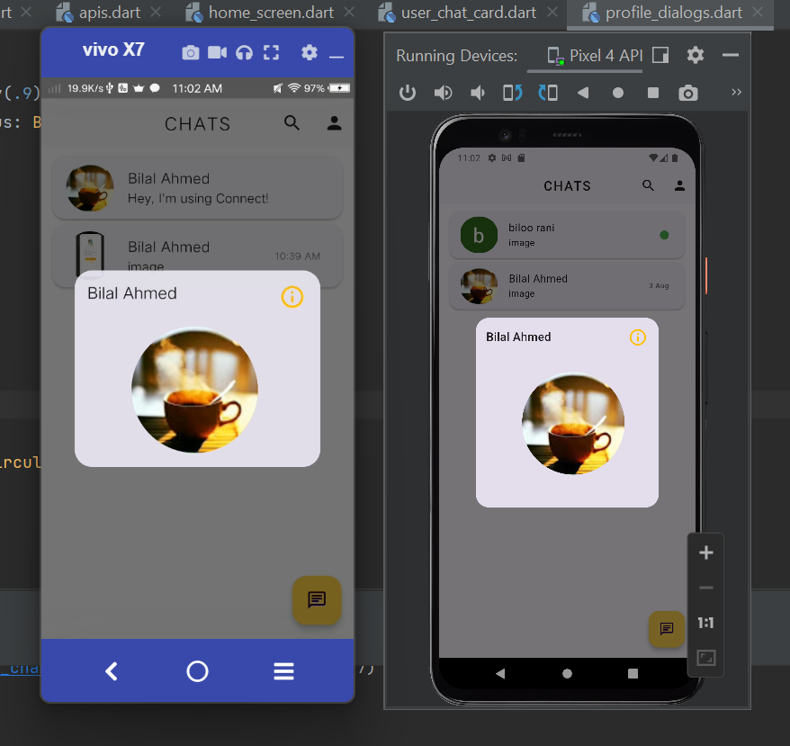
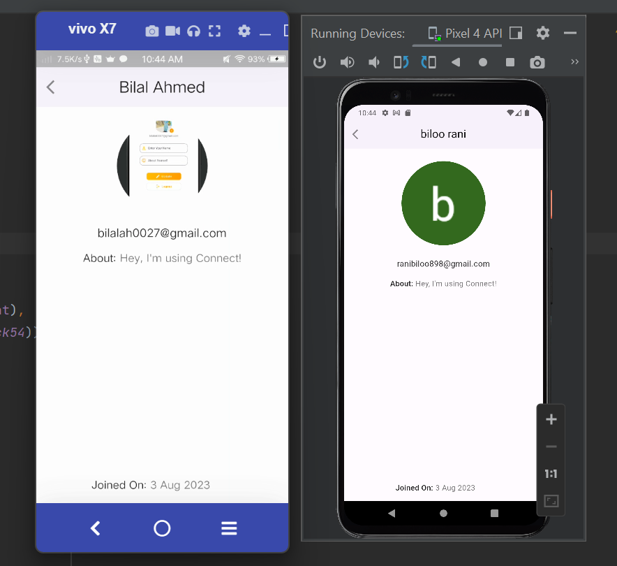

# 💬 Connect Chat App with Firebase

A real-time chatting application built using **Flutter** and **Firebase**, supporting authentication, real-time messaging, image sharing, and user profiles.

---

## 🚀 Features

- 🔐 Firebase Authentication (Email & Password)
- 💬 Real-time one-to-one chat
- 🖼️ Image sharing in chat
- 👤 User profiles
- 🔔 Live message updates
- ☁️ Firebase Firestore database
- 📷 Firebase Storage for images

---

## 🛠️ Tech Stack

- Flutter (Dart)
- Firebase Auth
- Cloud Firestore
- Firebase Storage
- Provider / MVVM (optional based on your project)

---

## 📸 Screenshots

|--------------|------------|----------------|

|Splash Screen|

 

|Login Screen|

  
 
|Add User Screen|

  
 
|Chat Screen|

 

|Image Sended In Chat|

 

|Profile Screen|

 

---

## 🎥 Demo Video

👉 Watch the full demo here:  

[Click to Watch Demo](https://youtube.com/shorts/HpZBOniBpSc?si=qEYpr4spASP4Dmg2)

---

